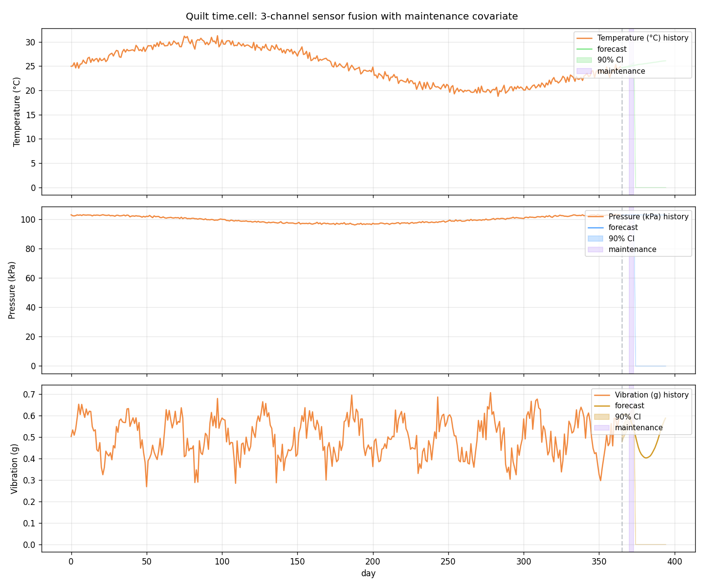
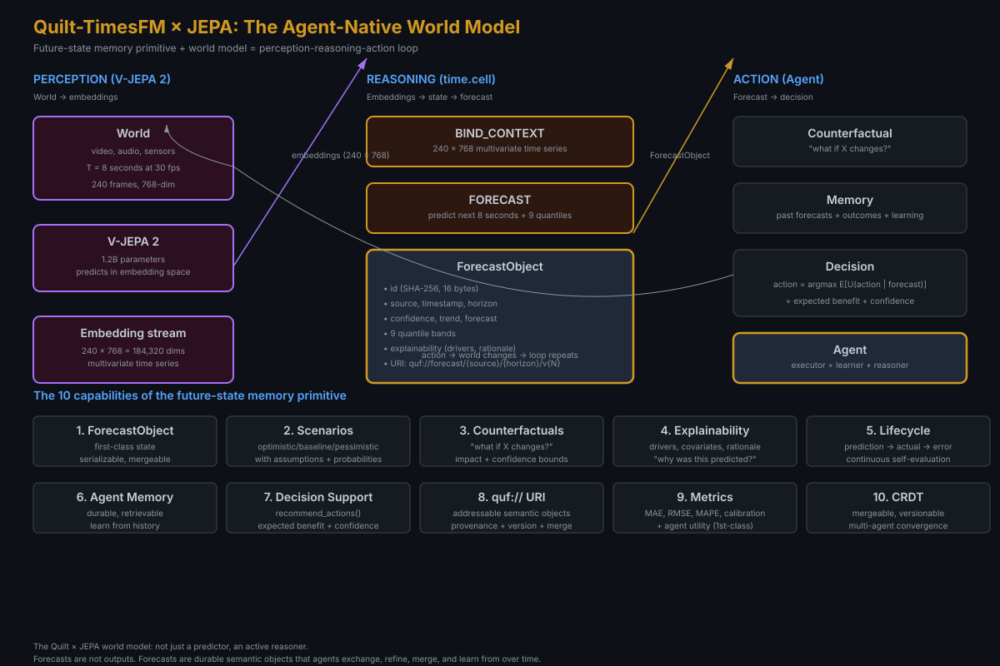

# quilt-timesfm

Python binding for [TimesFM 3.0](https://github.com/google-research/timesfm) as a `time.cell` in the [Quilt](https://github.com/SuperInstance) cellular-architecture framework. The same cell shape runs in C, Python, and Rust no_std, with bit-exact FNV-1a state hashing and a 32-byte PROOF chain.

[](https://www.python.org)
[](LICENSE)
[](tests/)
[](https://github.com/SuperInstance/quilt-timesfm/actions/workflows/test.yml)
[](docs/POLYFORMALISM.md)

<p align="center">
  
</p>

```bash
pip install -e .
```

```python
from quilt_cell import TimeCell
import numpy as np

cell = TimeCell()
cell.bind_context(np.sin(np.linspace(0, 8 * np.pi, 128)))  # 128 points of history
cell.set_horizon(16)
cell.forecast_()                                            # substrate: TimesFM 3.0

point = cell.read_point(0)        # shape (16,), the median forecast
q10   = cell.read_quantile(0.1, 0)  # 10th percentile
q90   = cell.read_quantile(0.9, 0)  # 90th percentile
```

49 cell tests + 49 temporal-reasoner tests, all green.

## What is a `time.cell`?

A cell is a node in a DAG. The `time.cell` kind is a cell whose state is a
historical time-series tensor, whose value is a forecast plus 9 quantile
prediction intervals, and whose reads are covariates. The 5 operations:

| # | Op | What it does |
|---|---|---|
| 0 | BIND_CONTEXT | Set the historical context (a 2D float array) |
| 1 | BIND_COVARIATE | Set covariates (past-only, or past-and-future) |
| 2 | FORECAST | Run the model, produce forecast + 9 quantiles |
| 3 | READ_POINT | Read the median forecast for a variate |
| 4 | READ_QUANTILE | Read a quantile prediction interval (q ∈ [0.1, 0.9]) |

The cell shape is bit-exact across C, Python, and Rust no_std. The
substrate (the model that does the work) is the only thing that varies.

## Why

Agents that act on the world need to forecast, and useful forecasts
come with a 90% prediction interval, a calibration score, and
recommendable actions. `temporal.py` is a 10-capability wrapper that
turns the `time.cell` into an agent-native primitive:

1. **ForecastObject** — first-class state with id, source, horizon, confidence, version, URI
2. **Scenarios** — optimistic, baseline, pessimistic
3. **Counterfactuals** — "what if X changes?" with impact + confidence
4. **Explainability** — major drivers, important covariates, prediction rationale
5. **Lifecycle** — record actuals, compute prediction error and calibration
6. **Agent memory** — durable store of forecasts
7. **Decision support** — `recommend_actions()` with expected benefit
8. **quf:// URI** — addressable: `quf://forecast/{source}/{horizon}/v{N}`
9. **Metrics** — MAE, RMSE, MAPE, calibration, pinball loss, agent utility
10. **CRDT** — mergeable, versionable, comparable across agents

`pip install -e .` and `from temporal import TemporalReasoner`.

## The polyformalism

The same cell shape runs in three languages, with bit-exact conformance.

| Aspect | C (`quilt-c`) | Python (this repo) | Rust no_std (`quilt-timesfm-rust`) |
|---|---|---|---|
| Kind | `"time.cell"` | `"time.cell"` | `"time.cell"` |
| Operations | 5 | 5 | 5 |
| State hash | FNV-1a 64-bit, 4 slices | FNV-1a 64-bit, 4 slices | FNV-1a 64-bit, 4 slices |
| Forecast point | `[H × V]` | `[H × V]` | `[H × V]` |
| Forecast quantiles | `[9, H × V]` | `[9, H × V]` | `[9, H × V]` |
| Real model | stub | TimesFM 3.0 | stub |
| Tests | 41 | 49 | 49 |

The same context tensor hashed by the C, Python, and Rust ports produces
the same 32-byte state hash. The same context, run through all three,
produces the same forecast shape. The substrate (real model vs synthetic
stub) is the only thing that varies.

The 4 L-tiers — same cell, four sizes:

| Tier | Target | Substrate | RAM |
|---|---|---|---|
| L0 | Cortex-M0+ | synthetic | 4KB |
| L1 | Cortex-M4 | synthetic | 16KB |
| L2 | ESP32-S3 | synthetic | 64KB |
| L3 | Workstation | real TimesFM 3.0 | 1.5GB+ |

The polyformalism claim is provable in 1 day. See
[`docs/POLYFORMALISM.md`](docs/POLYFORMALISM.md) for the full tour.

## Architecture

<p align="center">
  
</p>

The `time.cell` is one of 11 opcodes. The other 10 are
[BIND, LINK, EFFECT, VIEW, TICK, FORGET, PROOF, ROUTE, CRDT, WORLD](https://github.com/SuperInstance/quilt-c).
The 5+1 laws (BIND idempotence, LINK transitivity, EFFECT associativity,
VIEW purity, TICK monotonicity, FORGET completeness) hold across all 11.

## Documentation

- [`QUILT.md`](QUILT.md) — the Quilt-side adoption document
- [`docs/POLYFORMALISM.md`](docs/POLYFORMALISM.md) — the 3-language tour
- [`JEPA.md`](JEPA.md) — how `time.cell` composes with the JEPA family
- [`temporal.py`](temporal.py) — the 10-capability reasoner
- [`visualizer/index.html`](visualizer/index.html) — interactive cell-graph explorer (no build)
- [`paper_trading/`](paper_trading/) — end-to-end paper-trading agent: forecast → decide → execute → settle → calibrate
- [`robotics/`](robotics/) — robotics-shaped cells (SensorCell, ActionCell) and a 2-DOF pick-and-place demo
- [`notebooks/paper_trading.ipynb`](notebooks/paper_trading.ipynb) — interactive walkthrough of the paper trader with charts
- [`examples/`](examples/) — 8 runnable examples
- [`tests/test_quilt_cell.py`](tests/test_quilt_cell.py) — 49 conformance tests
- [`tests/test_temporal.py`](tests/test_temporal.py) — 49 temporal-reasoner tests
- [`tests/test_paper_trader.py`](tests/test_paper_trader.py) — 17 paper-trader tests
- [`tests/test_robotics.py`](tests/test_robotics.py) — 18 robotics tests
- [Quilt canon](https://github.com/SuperInstance/AI-Writings) — 401 papers
- [Quilt wiki](https://github.com/SuperInstance/quilt-wiki-2126) — 38 entries
- [Quilt architecture](ARCHITECTURE.md) — the single document for "what is Quilt"

## Run the tests

```bash
python3 tests/test_quilt_cell.py     # 49 tests — cell conformance
python3 tests/test_temporal.py       # 49 tests — temporal-reasoner conformance
python3 tests/test_paper_trader.py  # 17 tests — paper-trading agent
python3 tests/test_robotics.py      # 18 tests — robotics cells + 2-DOF arm
python3 examples/01_temperature.py  # univariate, 365d → 30d
python3 examples/02_stock.py        # univariate with covariate
python3 examples/03_demand.py       # 3-channel multivariate
python3 examples/04_anomaly.py      # 90% CI as anomaly band
python3 examples/05_multivariate.py # 3 sensors + maintenance covariate

# Run the paper trader end-to-end
python3 -m paper_trading --steps 500 --shock earnings_beat
```

## Applications

### Paper trading

`paper_trading/` is a complete agent that:
  1. Streams a price series (synthetic GBM by default; pluggable for real feeds)
  2. Binds the rolling history to a `TimeCell`
  3. Forecasts the next N steps with `forecast_trend()` (or real TimesFM 3.0)
  4. Decides buy / sell / hold via `TradingDecisionSupport`
  5. Executes on a `Portfolio` with position caps
  6. Records the actual outcome when the horizon elapses
  7. Updates the calibration score in the `AgentMemory`

Every trade is addressable via a `quf://forecast/{source}/{horizon}/v{N}/{id}`
URI, so trade logs from multiple agents can be CRDT-merged.

### Robotics

`robotics/` is the robotics-shaped interface. The cell model applies
to a sensor stream the same way it applies to a price stream:
  - **`SensorCell`** — context is a multivariate sensor stream
    (joint angles, IMU, force, vision features). Forecast is the
    next sensor state. This is the robotics equivalent of
    `time.cell`; the cell shape is identical.
  - **`ActionCell`** — context is a target trajectory. Forecast
    is the planned motion.
  - **`PickAndPlaceDemo`** — a 2-DOF arm with analytical
    inverse kinematics. Runs through a `home → pick → place` cycle
    using the cell model as the control loop.

The cell shape is preserved across applications. A real
implementation would use a JEPA-style latent dynamics model in
place of the linear extrapolation; see `JEPA.md` for the
synergy discussion.

## Contributing

The 1-day add workflow for a new polyformalism port:

1. Read the C port (`quilt-c/include/quilt/{cell,time}.h`).
2. Translate the 5 operations to your language (~2 hours).
3. Translate the 5+1 laws as property tests (~1 hour).
4. Implement FNV-1a 64-bit state hash (~1 hour).
5. Run the 49-test conformance suite (~30 minutes).
6. Open a PR to add the port to the polyformalism table.

Total: 7 hours. The bit-exact claim is provable in 1 day.

## License

- Source code in this repo: Apache 2.0
- TimesFM 3.0 source code: Apache 2.0
- TimesFM 3.0 pretrained weights: `timesfm-non-commercial-license-v1.0` (non-commercial, non-production)
- TimesFM 2.5 and earlier weights: Apache 2.0 (commercial use OK)

TimesFM 3.0 is by Google Research. The Quilt adoption is by SuperInstance.
